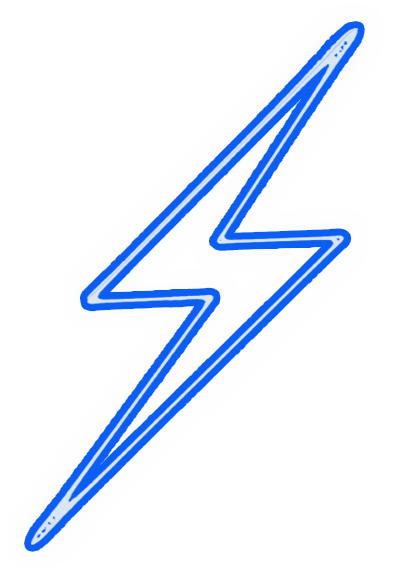

<div align="center">


# ⚡ FIT ZONE — Maquette Web

**Proposition commerciale · Design & Intégration web**

[](https://developer.mozilla.org/fr/docs/Web/HTML)
[](https://developer.mozilla.org/fr/docs/Web/CSS)
[]()
[]()

---

> *Ce projet est une maquette réalisée à titre de proposition commerciale.*
> *Il ne constitue pas un engagement contractuel et n'est pas encore en production.*

</div>

---

## Contexte

**Fit Zone** est un complexe sportif premium situé à **Bénesse-Maremne** (40), à 5 min de Capbreton et 10 min d'Hossegor. Cette maquette a été conçue de façon indépendante afin de proposer une vision concrète de ce que pourrait être le site web officiel du club — dans le but d'initier une collaboration.

---

## Pages de la maquette

| Fichier | Page | Description |
|---|---|---|
| `00-styleguide.html` | Style Guide | Palette, typographie, composants UI |
| `01-accueil.html` | Accueil | Page principale, hero, espaces, cours |
| `02-le-club.html` | Le Club | Histoire, valeurs, équipe, infrastructures |
| `03-tarifs.html` | Abonnements & Tarifs | Formules, options, services à la carte |
| `04-cours.html` | Cours | Planning, disciplines, intervenants |
| `05-kidzone.html` | KidZone | Espace garderie & activités enfants |
| `06-bien-etre.html` | Bien-être | Massages, récupération, soins |
| `07-galerie.html` | Galerie | Photos du club et des espaces |
| `08-blog.html` | Blog | Actualités, conseils fitness |
| `09-contact.html` | Contact | Formulaire, carte, horaires |
| `10-espace-membre.html` | Espace Membre | Dashboard personnel (concept) |
| `11-mentions-legales.html` | Mentions légales | Informations légales |
| `12-article-blog.html` | Article Blog | Gabarit article |

---

## Direction artistique

L'identité visuelle s'appuie sur une esthétique **industrielle premium** : tons sombres dominants, textures métal et béton, accents chauds et énergiques.

### Palette de couleurs

| Rôle | Couleur | Hex |
|---|---|---|
| Fond principal | Noir profond | `#101010` |
| Fond secondaire | Anthracite | `#1a1a18` |
| Bleu nuit | Accent froid | `#0e2640` |
| Orange vif | CTA / Énergie | `#ff5c31` |
| Terracotta | Accent chaud | `#aa491b` |
| Crème | Texte principal | `#f0e8dc` |

### Typographie

- **Display** — `A4 SPEED Bold` (titres, logo, accents)
- **Corps** — `Inter` via Google Fonts (texte courant)

---

## Services représentés

- **Musculation** — Plateau complet, haltères libres, racks, machines guidées
- **Cours collectifs** — RPM, Yoga, Zumba, HIIT, Cross-Training, Pilates
- **KidZone** — Garderie agréée et activités encadrées pour les enfants
- **Bien-être** — Massage sportif, récupération, sauna
- **Surf Training** — Préparation physique surf (spécificité locale)

---

## Chiffres mis en avant

| Indicateur | Valeur |
|---|---|
| Membres actifs | 500+ |
| Cours par semaine | 40+ |
| Années d'expérience | 10+ |
| Taux de satisfaction | 98% |

---

## Structure des fichiers

```
maquettes/
├── assets/                    # Logos, images, police custom
│   ├── Logo PNG.png
│   ├── Eclair_PNG.png
│   └── KidZone PNG.png
├── docs/                      # Documentation du projet
│   ├── wireframes.md          # Wireframes textuels des 12 pages
│   ├── Charte_graphique.pdf   # Charte graphique officielle
│   └── Information complémentaire Web Design Fit Zone.pdf
├── fonts/                     # Police A4 SPEED Bold
├── style.css                  # Feuille de style globale unique
├── 00-styleguide.html         # Référentiel de design
└── 01- … 12-*.html            # Pages de la maquette
```

---

## Comment ouvrir la maquette

Aucune dépendance, aucun build. Ouvrez simplement `01-accueil.html` dans un navigateur moderne.

```bash
# Optionnel — serveur local pour éviter les restrictions CORS
npx serve .
# ou
python3 -m http.server 8080
```

Puis naviguer vers `http://localhost:8080/01-accueil.html`

---

## Démarche

Cette maquette a été produite **en amont de tout accord commercial**, à partir des éléments de branding disponibles (logo, charte graphique) et d'une analyse du positionnement du club. Elle vise à :

1. Donner un aperçu concret et réaliste du rendu final
2. Valider l'adéquation entre la direction artistique et l'image de Fit Zone
3. Servir de base de discussion pour un devis et un planning de développement

---

<div align="center">

**Réalisé par** · Abdelatif Baha - AB Dev Web - Développeur web freelance · Pour Novaside 2026



</div>
